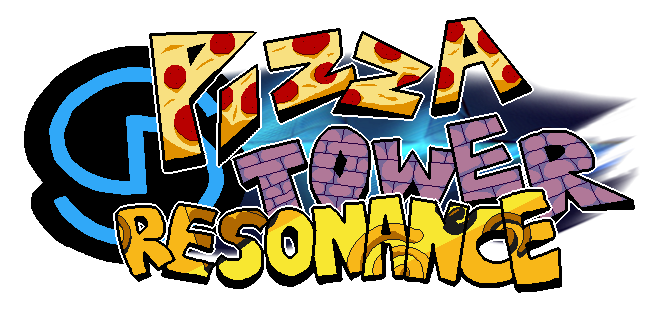

	

	(logo inspired by nailsrails)

# PT-Resonance
FMOD Source Project for base game **Pizza Tower** to add custom music and sounds to it. 
Base game audio files will be removed upon request from TDP 
# Requirements
- [FMOD Studio 2.02.xx](https://www.fmod.com/download#fmodstudio)
	- You need to be logged in order to download.
# Inspiration
- [Pizza Tower FMOD Hot-fix](https://gamebanana.com/tools/19709)
- [PT-FSPRO-Recreation](https://github.com/Raltyro/PT-FSPRO-Recreation)
- CheesedUP-FMOD (in this(these) fork(s) obviously.)
- [eeveeguy56811](https://github.com/eeveeguy56811)'s FMOD improvement in my boyfriend's mod